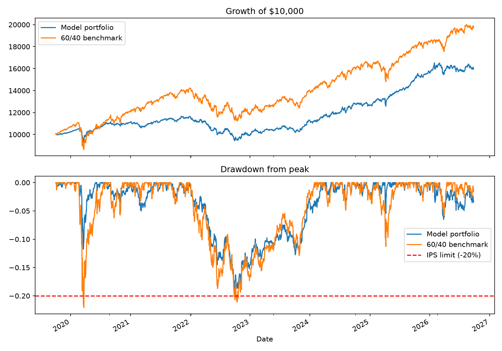

# Model Portfolio Backtest: John Doe (fictional client)

A walk-forward backtest of a multi-asset ETF portfolio built for a fictional client under a written Investment Policy Statement (IPS). It shows the full loop a portfolio manager works through: client constraints, allocation, benchmarking, and honest reporting.

Educational project.

## The client and the rules

John Doe is 45, wants long-term growth for retirement at 65, and will not accept a drop of more than 20% from a portfolio peak.

| Rule | Limit |
| --- | --- |
| **Instruments** | ETFs only, expense ratio 0.25% or less |
| **Direction** | Long only, no shorting or leverage |
| **Single holding** | Maximum 20% |
| **Stocks** | Maximum 70% |
| **Bonds** | Minimum 20% |
| **Maximum drawdown** | 20% (hard constraint) |
| **Rebalancing** | Once a year |
| **Benchmark** | 60% VOO / 40% BND |

## Method

1. **Universe:** 11 ETFs (VOO, IJR, VEA, VWO, BND, VGLT, VCIT, SCHP, VNQ, IAU, SHV) covering US and international stocks, four kinds of bonds, real estate, gold, and short-term Treasuries. Each has a full 10-year price history.
2. **Optimizer:** Mean-variance optimization that maximizes the Sharpe ratio (2% risk-free rate) using every IPS rule, including a maximum-drawdown constraint on the training data (15% target, leaving a cushion under the 20% limit).
3. **Walk-forward testing:** Each year the optimizer sees only the previous three years of data, sets weights, and holds them for one year. This avoids testing on data the optimizer has already seen, and leaves about seven years of results (Oct 2019 to Sep 2026).
4. **Benchmark:** 60% VOO / 40% BND, rebalanced on the same dates (annually).

## Results

| Measure | Model portfolio | 60/40 benchmark |
| --- | --- | --- |
| **Annual return** | 7.0% | 10.3% |
| **Volatility** | 8.3% | 12.7% |
| **Sharpe ratio** | 0.62 | 0.68 |
| **Worst drawdown** | -19.1% | -22.1% |
| **COVID crash return (Feb 19 - Mar 23, 2020)** | -9.9% | -21.8% |
| **2022 return (full year)** | -14.4% | -16.3% |



**Verdict:** The portfolio stayed within the client's 20% drawdown limit and lost far less than the benchmark in the 2020 crash, but it earned less return and a lower Sharpe ratio than the plain 60/40, and likely fell short of the return goal after inflation.

## What went wrong

- The optimizer kept maxing out its favorites. VOO was at the 20% cap in six of seven yearly rebalances, a known weakness of optimizers that chase what recently did best.
- The drawdown margin was thin: the optimizer aimed for 15% on its training data, yet the real worst fall reached 19.1%.
- The benchmark won on return because the period was strong for US stocks.
- Taxes and trading costs are ignored.
- The risk-free rate is a fixed 2%, and there are only about seven years of out-of-sample results.

## Files

| File | What it does |
| --- | --- |
| **data_pull.py** | Downloads about 10 years of adjusted prices with yfinance, checks every ETF has a full history, and saves prices and daily returns |
| **backtest.py** | Runs the walk-forward optimization and backtest, prints results, and saves CSV files and a chart |
| **dashboard.py** | Interactive Streamlit dashboard with the IPS, scorecard, growth, drawdown, weights, and stress tests |

## How to run

```
pip install yfinance pandas numpy scipy matplotlib streamlit
python data_pull.py
python backtest.py
streamlit run dashboard.py
```

Run the commands from the project folder. `backtest.py` needs the `data` folder that `data_pull.py` creates, and the dashboard needs the files that `backtest.py` saves there.

## Ideas for next steps

- Add trading costs and taxes
- Replace historical averages with more stable return estimates to avoid maxed-out positions
- Test different lookback windows and rebalancing strategies
